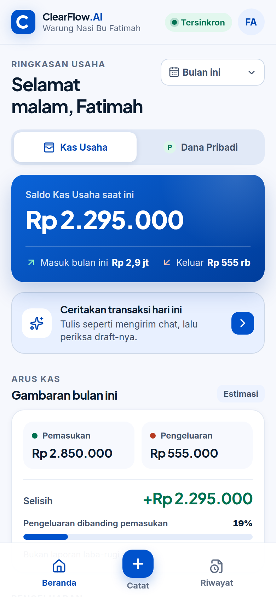
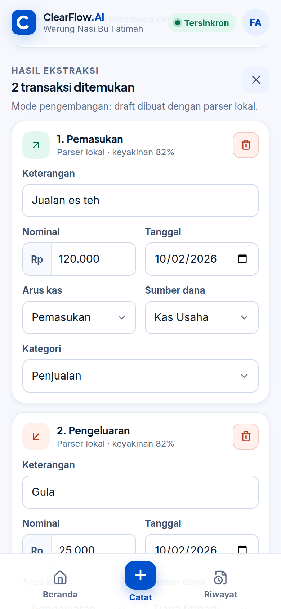
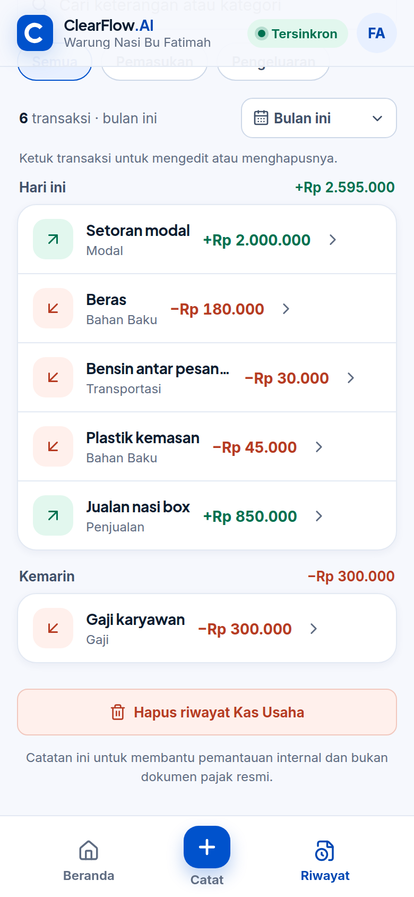
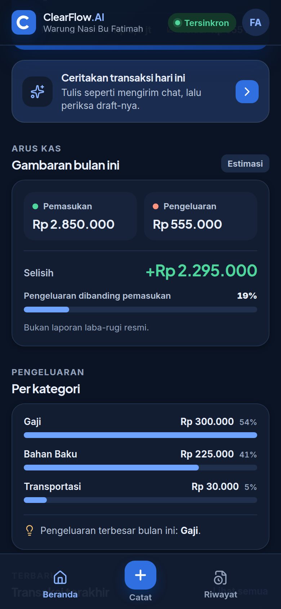
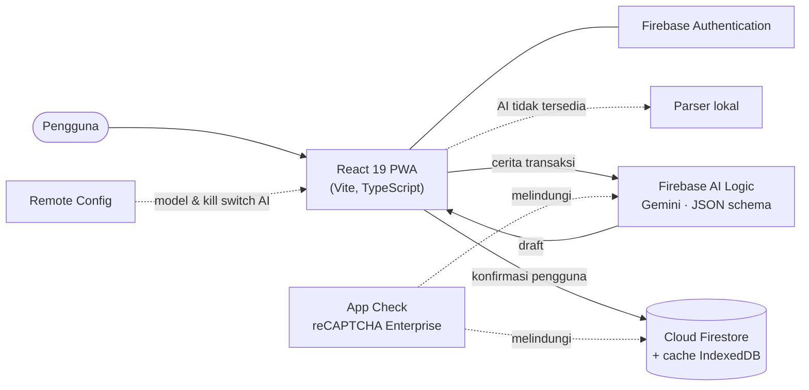

<div align="center">


# ClearFlow.AI

**Pembukuan UMKM yang terasa seperti bercerita.**
Tulis transaksi seperti chat, Gemini menyiapkan draft, Anda yang mengonfirmasi — Kas Usaha dan Dana Pribadi dihitung terpisah.

[](https://github.com/opallama110-alt/ClearFlow/actions/workflows/ci.yml)


**[Coba aplikasinya → clearfloww.web.app](https://clearfloww.web.app)**

</div>

<p align="center">
  
  
  
  
</p>

## Masalah dan solusi

Banyak pelaku UMKM mencampur uang usaha dengan uang pribadi dan berhenti mencatat karena pembukuan terasa rumit. ClearFlow.AI membuat pencatatan semudah mengirim pesan:

1. **Ceritakan** transaksi dengan bahasa sehari-hari — “jualan 300rb, beli plastik 50rb pakai kas usaha”.
2. **Gemini** (melalui Firebase AI Logic) menyusun draft terstruktur: nominal, tanggal, arus kas, sumber dana, kategori.
3. **Periksa** draft. Bagian yang belum pasti ditandai dan wajib dipilih pengguna — AI tidak pernah menyimpan sendiri.
4. **Pantau** saldo Kas Usaha dan Dana Pribadi secara terpisah, lengkap dengan rasio pengeluaran dan rincian kategori.

ClearFlow.AI diajukan oleh **Fatimah Azzahra** pada program **ImpactPreneur** dan masuk daftar 10 finalis Final Pitching. Materi pitching dan bimbingan diarsipkan di [`docs/kompetisi`](docs/kompetisi).

## Fitur

- **Catat dengan cerita** — Gemini + structured JSON output, divalidasi ulang di klien. Jika AI tidak tersedia (offline, kuota, timeout 15 detik), **parser lokal** berbasis aturan tetap menyiapkan draft.
- **Formulir manual** — beberapa transaksi sekaligus, input nominal fleksibel (`1 jt`, `250rb`, `1.500.000`), validasi per kolom.
- **Dua dompet terpisah** — saldo, arus kas, dan riwayat Kas Usaha vs Dana Pribadi.
- **Dashboard** — saldo, pemasukan/pengeluaran per periode, meter rasio pengeluaran, pengeluaran per kategori.
- **Riwayat** — dikelompokkan per hari, pencarian, filter, edit/hapus, ekspor CSV (aman dari *CSV injection*).
- **Offline-first** — data tetap bisa dicatat tanpa internet, tersimpan di perangkat, dan tersinkron otomatis; status sinkron terlihat di header dan setiap transaksi.
- **PWA** — dapat dipasang di layar utama, cangkang aplikasi tersedia offline, pemberitahuan versi baru.
- **Akun fleksibel** — Google, email/kata sandi, atau akun tamu yang bisa ditautkan kemudian tanpa kehilangan data.
- **Mode gelap**, aksesibel (lulus pemeriksaan axe WCAG 2.1 AA), dan ramah ponsel maupun desktop.

## Arsitektur



| Lapisan | Teknologi | Catatan |
| --- | --- | --- |
| UI | React 19, TypeScript (strict), Vite 8, CSS design tokens | Ruang kerja dimuat *lazy*; halaman masuk tidak mengunduh Firestore |
| Data | Cloud Firestore + persistent local cache | Listener realtime bertahap per 500 dokumen; saldo memakai agregasi `sum()` server bila riwayat panjang |
| AI | Firebase AI Logic (Gemini), Remote Config | Model dan sakelar AI dapat diubah tanpa rilis ulang |
| Keamanan | Firebase Auth, App Check, Security Rules, header Hosting | Rules memvalidasi skema, batas nilai, kepemilikan, dan timestamp server |
| Observability | Analytics, Performance Monitoring, error boundary | Tidak ada isi cerita atau nominal yang dikirim ke Analytics |
| Kualitas | Vitest, Firebase Emulator, Playwright, axe-core, GitHub Actions | Semua pengujian berjalan di emulator — tanpa menyentuh data production |

## Kualitas dan pengujian

| Lapisan uji | Cakupan |
| --- | --- |
| **Unit** (`npm test`) | Parser nominal & bahasa sehari-hari, format tanggal zona Jakarta, ringkasan keuangan, CSV |
| **Security Rules** (`npm run test:rules`) | Isolasi antar-pengguna, validasi skema, timestamp palsu, path tak dikenal |
| **End-to-end** (`npm run test:e2e`) | Akun tamu & email, setup, catat manual/cerita, edit/hapus, offline → sinkron, tema, hapus akun |
| **Aksesibilitas** | axe-core WCAG 2.1 AA pada mode terang dan gelap |
| **CI** | Setiap push dan pull request menjalankan semua lapisan di atas |

## Menjalankan secara lokal

Prasyarat: Node.js 20.19+ dan (untuk emulator) Java 17+ serta Firebase CLI (`npm install -g firebase-tools`).

```bash
npm install

# Opsi A — aman untuk eksperimen: Auth & Firestore lokal (proyek demo, tanpa data production)
npm run emulators          # terminal 1
npm run dev:emulators      # terminal 2 → http://localhost:5173

# Opsi B — terhubung ke Firebase production
cp .env.example .env.local # isi VITE_FIREBASE_APPCHECK_SITE_KEY
npm run dev
```

Dalam mode emulator, App Check, Analytics, dan Remote Config dinonaktifkan, dan draft cerita dibuat oleh parser lokal.

| Skrip | Fungsi |
| --- | --- |
| `npm run check` | Lint + unit test + build production |
| `npm run test:rules` | Uji Firestore Security Rules di emulator |
| `npm run test:e2e` | Playwright + axe di emulator (build mode `e2e`) |
| `npm run test:e2e:live` | Smoke test terhadap https://clearfloww.web.app |
| `npm run deploy` | `check`, lalu deploy rules, index, Remote Config, dan Hosting |

## Deploy

```bash
npm run deploy   # firebase deploy --only firestore,remoteconfig,hosting --project clearfloww
```

- `firestore` kini juga mendeploy **`firestore.indexes.json`** (index agregasi saldo). Sampai index selesai dibuat, aplikasi otomatis memakai perhitungan lokal.
- Header Hosting menegakkan `frame-ancestors`, `object-src`, dan `base-uri`, serta memasang **CSP lengkap dalam mode Report-Only**. Setelah deploy, buka aplikasi, login dengan Google, dan coba fitur Gemini; jika console browser tidak menampilkan pelanggaran CSP, ganti kunci `Content-Security-Policy-Report-Only` menjadi `Content-Security-Policy` di `firebase.json`.
- **Deploy otomatis (opsional):** buat service account Firebase Hosting, simpan JSON-nya sebagai secret `FIREBASE_SERVICE_ACCOUNT_CLEARFLOWW`, lalu jalankan workflow **Deploy** dari tab Actions.

## Struktur proyek

```text
src/
  App.tsx              Gerbang autentikasi (memuat ruang kerja secara lazy)
  workspace/           Status dan aksi ruang kerja setelah masuk
  screens/             Dashboard, Catat, Riwayat
  components/          Modal aksesibel, kartu draft, editor, profil, dll.
  hooks/               Data realtime, toast, konfirmasi, tema, status online
  lib/                 Parser, AI, data Firestore, ringkasan, CSV, format (+ unit test)
tests/rules/           Uji Firestore Security Rules
e2e/                   Playwright (emulator) dan e2e/live (production)
docs/                  Screenshot README dan arsip materi kompetisi
```

## Skema data Firestore

```text
businesses/{uid}
  ownerId, ownerName, name, businessType, city, bookkeepingStartDate
  openingBusinessBalance, openingPersonalBalance, aiProcessingConsent
  onboardingCompleted, productTourVersion, timezone, currency, plan, schemaVersion
  createdAt, updatedAt                         ← wajib serverTimestamp()

businesses/{uid}/transactions/{id}
  date, description, amount, flow, fund, category
  status, source, confidence, model?, schemaVersion
  createdAt, updatedAt                         ← wajib serverTimestamp()
```

## Batas produk

- Hasil Gemini atau parser selalu berupa draft dan memerlukan konfirmasi pengguna.
- Ringkasan bukan laporan akuntansi atau dokumen pajak resmi.
- Akun tamu terikat pada browser; hubungkan email atau Google sebelum memakai data penting.

---

<details>
<summary><strong>English summary</strong></summary>

**ClearFlow.AI** is a mobile-first bookkeeping PWA for Indonesian micro and small businesses. Users describe transactions in everyday language; Gemini (via Firebase AI Logic, protected by App Check) returns schema-validated drafts that the user must confirm, with a rule-based local parser as a fallback. Business cash and personal money are tracked as separate balances.

Highlights: React 19 + TypeScript, offline-first Firestore with pending-sync indicators, server-side `sum()` aggregation for long histories, strict Security Rules with unit tests, Playwright end-to-end tests and axe accessibility checks running against the Firebase Emulator Suite in CI, dark mode, installable PWA, and hardened Hosting headers.

</details>
